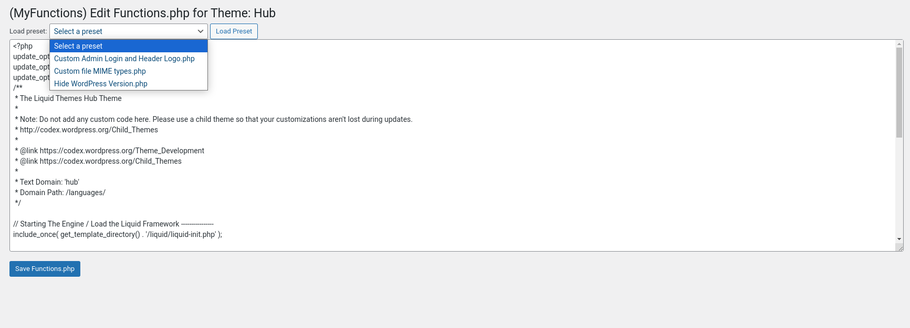

# MyFunctions Plugin

**Contributors:** Philip Mello & ChatGPT
**Tags:** custom code, functions.php, WordPress plugin
**Requires at least:** 5.0
**Tested up to:** 6.6
**Stable tag:** 1.2
**License:** GPLv2 or later
**License URI:** https://www.gnu.org/licenses/gpl-2.0.html
**Github:** https://github.com/PhilipMello/wp-plugin-MyFunctions

MyFunctions is a simple WordPress plugin that allows you to add custom PHP code directly into the `functions.php` file of the active theme through an easy-to-use admin interface.

## Description

MyFunctions provides an intuitive way to add custom code snippets to your theme's `functions.php` file without manually editing the file. It includes a text area where you can write or modify your code, and a save button that changes color based on whether the content has been altered, offering a visual cue for unsaved changes.

### Features

- Add custom PHP code directly to the `functions.php` file of your current theme.
- Simple admin interface with a code editor and save button.
- The save button changes from green to red when the code is modified, preventing accidental unsaved changes.
- Automatically appends code to the existing `functions.php` file.

## Installation

1. Download the MyFunctions plugin.
2. Extract the contents of the zip file to your WordPress plugins directory (`/wp-content/plugins/`).
3. Activate the plugin through the **Plugins** page in WordPress.
4. Navigate to the **MyFunctions** section in the WordPress admin menu.

## How to Use

1. After activating the plugin, go to **MyFunctions** in the admin sidebar.
2. In the text area, write or paste your custom PHP code.
3. If you modify the text, the save button will turn red, indicating unsaved changes.
4. Click the **Save** button to append the code to your theme’s `functions.php` file.

## Important Notes

- This plugin directly modifies the `functions.php` file of the active theme. Ensure you have proper backups before making changes.
- Syntax errors in the `functions.php` file can cause your site to malfunction. Always review the code before saving.

## Frequently Asked Questions

### Q: Can I undo changes made to `functions.php`?
A: No, MyFunctions appends code directly to the file, so be sure to save backups of your `functions.php` file before making any changes.

### Q: What happens if I deactivate the plugin?
A: The plugin will no longer provide the interface for adding code, but any previously saved code in `functions.php` will remain intact.

### Q: Is there syntax highlighting in the text area?
A: Currently, MyFunctions does not support syntax highlighting. This feature may be added in a future update.

## Screenshots

1. **Plugin Admin Page**  
   

## Changelog

### 1.0
- Initial release of MyFunctions.
  
### 1.1
- Preset functions added.

### 1.2
- BugFix.

## License

This plugin is licensed under the GPLv2 or later. You are free to modify and distribute the plugin under the terms of this license.
